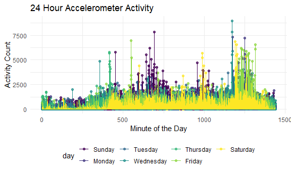

p8105\_hw3\_lw2883
================
Leighanne Wang
10/6/2020

## Problem 1

``` r
data("instacart")
```

This dataset contains **1384617 rows** and **15 columns**. Observations
are on the level of items in orders by user. There are user and order
variables such as user ID, order ID, order day, and order hour. There
are also item variables such as name, aisle, department, and some
numeric codes.

*How many aisles and which aisles are most items from?*

``` r
aisle_num =    
  instacart %>% 
    count(aisle) %>% 
    arrange(desc(n)) 
```

There are **134 aisles**. Most items are ordered from the Fresh
Vegetables, Fresh Fruits, and Packaged Vegetables Fruits aisles.

*Plot showing number of items ordered in each aisle (only aisles with
more than 10,000 items ordered)*

``` r
instacart %>% 
  count(aisle) %>% 
  filter(n > 10000) %>% 
  mutate(
    aisle = factor(aisle),
    aisle = fct_reorder(aisle, n)
  ) %>% 
  ggplot(aes(x = aisle, y = n)) +
  geom_point() +
  theme(axis.text.x = element_text(angle = 90, vjust = 0.5, hjust = 1))
```


*Table showing 3 most popular items in each of these aisles: baking
ingredients, dog food care, packaged vegetables fruits*

``` r
instacart %>% 
  filter(aisle %in% c("baking ingredients", "dog food care", "packaged vegetables fruits")) %>% 
  group_by(aisle) %>% 
  count(product_name) %>% 
  mutate(rank = min_rank(desc(n))) %>% 
  filter(rank < 4) %>% 
  arrange(aisle, rank) %>% 
  knitr::kable()
```

| aisle                      | product\_name                                 |    n | rank |
| :------------------------- | :-------------------------------------------- | ---: | ---: |
| baking ingredients         | Light Brown Sugar                             |  499 |    1 |
| baking ingredients         | Pure Baking Soda                              |  387 |    2 |
| baking ingredients         | Cane Sugar                                    |  336 |    3 |
| dog food care              | Snack Sticks Chicken & Rice Recipe Dog Treats |   30 |    1 |
| dog food care              | Organix Chicken & Brown Rice Recipe           |   28 |    2 |
| dog food care              | Small Dog Biscuits                            |   26 |    3 |
| packaged vegetables fruits | Organic Baby Spinach                          | 9784 |    1 |
| packaged vegetables fruits | Organic Raspberries                           | 5546 |    2 |
| packaged vegetables fruits | Organic Blueberries                           | 4966 |    3 |

*Table showing the mean hour of the day at which Pink Lady Apples
vs. Coffee Ice Cream are ordered on each day of the week*

``` r
instacart %>% 
  filter(product_name %in% c("Pink Lady Apples", "Coffee Ice Cream")) %>%
  group_by(product_name, order_dow) %>% 
  summarize(mean_hour = mean(order_hour_of_day)) %>% 
  pivot_wider(
    names_from = order_dow,
    values_from = mean_hour
  ) %>% 
  knitr::kable()
```

| product\_name    |        0 |        1 |        2 |        3 |        4 |        5 |        6 |
| :--------------- | -------: | -------: | -------: | -------: | -------: | -------: | -------: |
| Coffee Ice Cream | 13.77419 | 14.31579 | 15.38095 | 15.31818 | 15.21739 | 12.26316 | 13.83333 |
| Pink Lady Apples | 13.44118 | 11.36000 | 11.70213 | 14.25000 | 11.55172 | 12.78431 | 11.93750 |

## Problem 2

*Read the accelerometer dataset. Tidy data, create weekday/weekend
variable, encode variable classes:*

``` r
accel_df =
  read_csv("./data/accel_data.csv") %>% 
    janitor::clean_names() %>% 
    pivot_longer(
      activity_1:activity_1440,
      names_to = "minute",
      names_prefix = "activity_",
      values_to = "activity_counts") %>% 
    mutate(
      minute = as.double(minute),
      day_type = recode(day, "Saturday" = "weekend", "Sunday" = "weekend", "Monday" = "weekday", "Tuesday" = "weekday", "Wednesday" = "weekday", "Thursday" = "weekday", "Friday" = "weekday")
      )
```

This dataset contains data collected from an accelerometer of a 63 year
old male with a BMI of 25 and congestive heart failure. Variables
included in this dataset are week number, day (including day ID number
and type of day), minute, and activity count for each minute of a day.
There are **50400 rows** and **6 columns**.

*Aggregate across minutes to create total activity over the day and
create table to show totals*

``` r
accel_df %>% 
  mutate(
    day = forcats::fct_relevel(day, c("Sunday", "Monday", "Tuesday", "Wednesday", "Thursday", "Friday", "Saturday"))
    ) %>% 
  group_by(week, day) %>% 
  summarize(
    total_activity = sum(activity_counts)
  ) %>%
  pivot_wider(
    names_from = day,
    values_from = total_activity
  ) %>% 
   knitr::kable()
```

| week | Sunday |    Monday |  Tuesday | Wednesday | Thursday |   Friday | Saturday |
| ---: | -----: | --------: | -------: | --------: | -------: | -------: | -------: |
|    1 | 631105 |  78828.07 | 307094.2 |    340115 | 355923.6 | 480542.6 |   376254 |
|    2 | 422018 | 295431.00 | 423245.0 |    440962 | 474048.0 | 568839.0 |   607175 |
|    3 | 467052 | 685910.00 | 381507.0 |    468869 | 371230.0 | 467420.0 |   382928 |
|    4 | 260617 | 409450.00 | 319568.0 |    434460 | 340291.0 | 154049.0 |     1440 |
|    5 | 138421 | 389080.00 | 367824.0 |    445366 | 549658.0 | 620860.0 |     1440 |

Looking at the total activity over the days and weeks, we see that for
the most part total activity count ranges from 300,000 to around
600,000. What is noticeable is that the last two weekends in the dataset
have less total activity count than in previous weekends, especially
Saturday which has significantly less activity count than any other day
with only 1440 total activity count.

*Single-panel plot of 24 hour activity count from accelerometer data for
each day*

``` r
accel_df %>% 
  mutate( day = forcats::fct_relevel(day, c("Sunday", "Monday", "Tuesday", "Wednesday", "Thursday", "Friday", "Saturday"))
    ) %>%
  ggplot(aes(x = minute, y = activity_counts, color = day)) +
    geom_point(alpha = .7) +
    geom_line() +
    labs(
      title = "24 Hour Accelerometer Activity",
      x = "Minute of the Day",
      y = "Activity Count"
    )
```



This graph shows the accelermeter activity count across the 24 hours of
a each day. Although it may be a little hard to see, this graph shows us
that there is the least amount of activity count throughout the night
which makes sense because they are most likely sleeping/resting during
this period of time. Additionally, there seems to be a jump in activity
count right before this period of low activity count during the night.
Other periods of high activity can be seen during noon on Sundays.

## Problem 3

*Load the NY NOAA dataset and describe the dataset*

``` r
data("ny_noaa")
```

This dataset shows the information from NOAA for the state of New York
from January 1, 1981 through December 31, 2010. There are **2595176
observations** and **7 variables**. It contains the variables: ID which
corresponds to the different weather stations, date of observation,
precipitation (tenths of mm), snowfall (mm), snow depth (mm), maximum
temperature (tenths of C) and minimum temperature (tenths of C).

*Clean data: separate variables for year, month, day; give reasonable
units for variables.*

``` r
clean_ny_noaa =   
  ny_noaa %>% 
  separate(date, sep = "-", into = c("year", "month", "day")) %>% 
  mutate(
    prcp = (prcp / 10), # convert units to mm
    tmin = as.integer(tmin) / 10, # convert units to C
    tmax = as.integer(tmax) / 10 # convert units to C
  )
```

*Most commonly observed values for snowfall*

``` r
snowfall =    
  clean_ny_noaa %>% 
    count(snow) %>% 
    arrange(desc(n)) 
```

This dataset now has precipitation converted to mm and the maximum and
minimum temperature variables are converted to degrees C. The most
commonly observed snowfall values are 0 because this dataset contains
observations throughout the entire year and New York State only
experiences snow in the winter. Next we have “NA” or missing values as
the next most common because

*Two-panel plot showing average max temperature in January and July in
each station across years*

``` r
clean_ny_noaa %>% 
  group_by(id, year, month) %>% 
  summarize(
    mean_tmax = mean(tmax, na.rm = TRUE)
  ) %>% 
  filter(month %in% c("01", "07")) %>% 
  ggplot(aes(x = year, y = mean_tmax, color = month)) +
  geom_point(alpha = .5) +
  facet_grid(. ~ month) +
  theme(axis.text.x = element_text(angle = 90, vjust = 0.5, hjust = 1))
```


The dots represent each station’s recorded mean maximum temperature
throughout the years from 1981 to 2010. As we can see from the plots,
the month of January has much lower mean temperatures compared to the
July. Overall, the mean maximum temperatures seem to be very consistent
over the 30 year period. Winter temperatures have a wider range of mean
values than compared to the summer temperatures.

*Two-panel plot showing tmax vs tmin for full dataset and distribution
of snowfall values greater than 0 and less than 100 by year*

``` r
tmax_tmin =
  clean_ny_noaa %>% 
  ggplot(aes(x = tmax, y = tmin)) +
  geom_density2d() +
    labs(
      title = "Maximum vs Minimum Temperatures in NYS",
      x = "Maximum Temperature",
      y = "Minimum Temperature"
    )

distr_snowfall = 
  clean_ny_noaa %>% 
  filter(snow > 0, snow < 100) %>% 
  ggplot(aes(x = year, y = snow)) +
  geom_boxplot() +
    labs(
      title = "Distribution of Snowfall (0-100mm) by Year",
      x = "Year",
      y = "Snowfall"
    ) +
  theme(axis.text.x = element_text(angle = 90, vjust = 0.5, hjust = 1))
  
tmax_tmin / distr_snowfall
```


This plot on the top shows the maximum vs. minimum temperatures of all
the stations throughout the full time period. As we can see, the highest
density areas are around when both the minimum and maximum temperatures
are around 0 degrees Celsius and around 20-30 degrees Celsius.

The bottom plot shows us the distribution of snowfall values greater
than 0 and less than 100mm by year. Based on the boxplots for each year
we can see that the distribution of snowfall seems to be very stable
throughout this entire time period, the median snowfall for this plot is
25mm.
